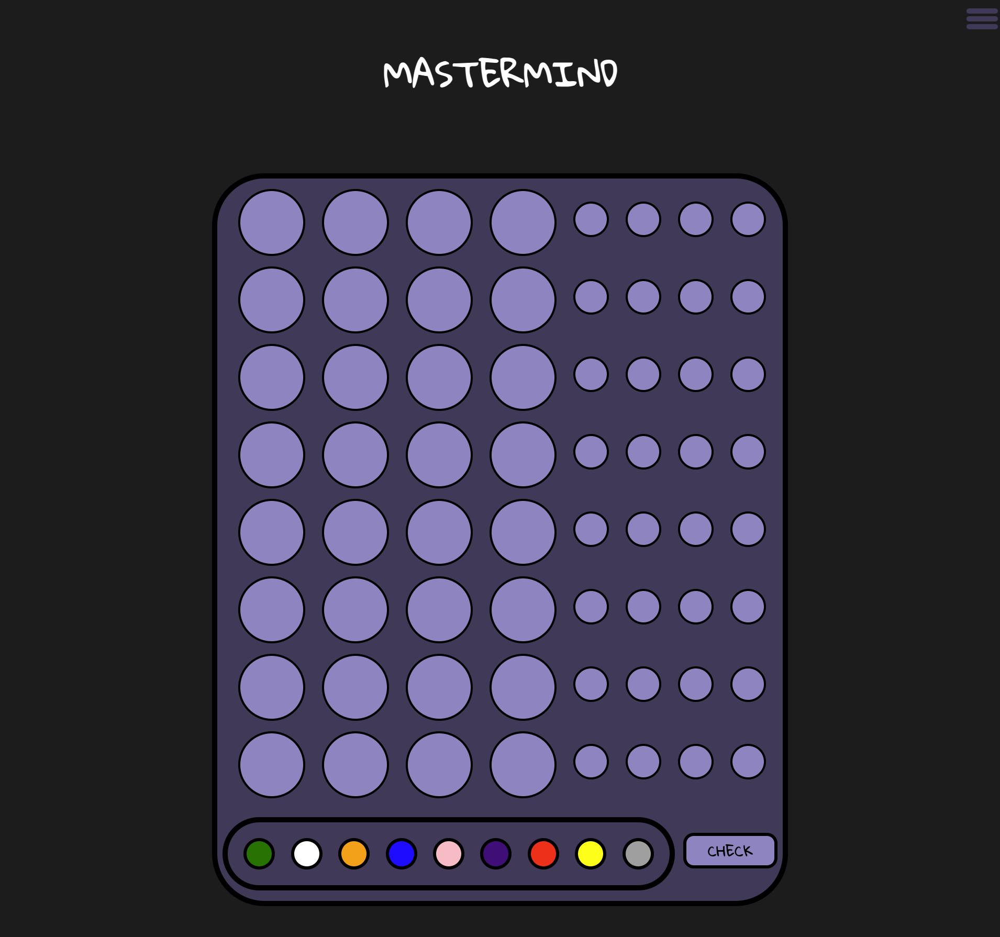

# Project 1: Mastermind Game



> Mastermind was created in 1970 by Mordecai Meirowitz in Israel. It resembles an old pencil and paper game called Bulls and Cows which may date back a century.

## Game and Instructions

[Play Mastermind here](https://joemarney.github.io/unit-1-project-mastermind/)

- The idea of the game is to correctly decipher a mystery code of 4 colours.
- You input your guess and then receive feedback on each turn:
  - Green dot means you have guessed the correct colour and it is also in the correct position.
  - Orange dot means you have guessed the correct colour but it is in the incorrect position.
  - Blank means the colour you guessed was not in the mystery code at all.
- You have 8 turns to guess the correct code.

## Accessing the Code

To check out my code you can go to my [GitHub repo][link].

[link]: https://github.com/joemarney/unit-1-project-mastermind

You can either use the inbuilt code viewer or you can download the zip to see it in your preferred code editor.

## Brief

- Render the game in the browser.
- Include win/loss logic and render a win/loss message to the player.
- Organised directory structure of HTML, CSS and JS files.
- Include required features (Audio)
- Deploy the game online.

### Timeframe

We as a class had a week to complete this task. We have been mainly working independently. We have been helping each other when needed.

## Technologies Used

- Figma
- JavaScript
- HTML
- CSS
- Google Fonts
- VS Code
- GitHub
- Chrome Dev Tools
- Chat GPT

## Planning

I planned my project using Figma. This allowed me to really visualise my project from day one. Once I had started the coding portion I had realised that my plan was fairly ambitious for my level of JS knowledge.


### User Stories

#### These are declarations that aid the design of the application by clearly stating what is required.

- **As a user,** I want the application to be aesthetically pleasing, clean and clear from an accessibility standpoint.
- **As a user,** I want to see a title screen when I arrive so I know I'm on the right page.
- **As a user,** I want the title screen to have clear and unambiguous buttons that can take me to play the game, show me how to play the game, and some options for the game.
- **As a user,** I want to be able to easily click on the buttons while playing and they should work as intended.
- **As a user,** I want to see a visual change on the page to show me that my selection has been understood.
- **As a user,** I want the feedback from each turn to be clear and concise.
- **As a user,** I want to be able to see when the game is over.
- **As a user,** I want the option to play again.

### Pseudocode

#### This is notation resembling a simplified programming language. It helps better understand how the application functions.

1. Define variables to track the state of the game:

   - Randomly generated code.
   - The player's choices.
   - The feedback for player's guesses.
   - The game's result.
   - The result message.

2. Cached elements

   - Home button.
   - Each guess.
   - Colour selector.
   - Check button.
   - Feedback.
   - Reset button.

3. Required constants:

   - Possible colours.
   - Amount of turns.
   - Length of secret code.

4. Generate a random colour code.

5. Handle the player clicking buttons.

6. Check if player has guessed correctly.

7. Render a win/loss message to the player.

## Coding Process

```javascript
const colourSelector = document.querySelectorAll(".colour");
const checkBtn = document.querySelector(".check");
const resultMsg = document.querySelector(".message");
const hamMenu = document.querySelector(".ham-menu");
const offScreenMenu = document.querySelector(".off-screen-menu");
const themeBtn = document.querySelector("#light");
const instructions = document.querySelector(".how-to");
const navBar = document.querySelector(".nav-bar");
const exitBtn = document.querySelector(".exit");
const showInstructions = document.querySelector("#instructionsPage");
const modeToggle = document.querySelectorAll(".mode");
const timerBtn = document.querySelector(".add-timer");
const timeLeft = document.querySelector("#time");

const secretCode = document.querySelectorAll(
  "#secret1, #secret2, #secret3, #secret4"
);
const turns = [
  document.querySelectorAll(".first"),
  document.querySelectorAll(".second"),
  document.querySelectorAll(".third"),
  document.querySelectorAll(".fourth"),
  document.querySelectorAll(".fifth"),
  document.querySelectorAll(".sixth"),
  document.querySelectorAll(".seventh"),
  document.querySelectorAll(".eighth"),
];

const feedback = [
  document.querySelectorAll(".hint1"),
  document.querySelectorAll(".hint2"),
  document.querySelectorAll(".hint3"),
  document.querySelectorAll(".hint4"),
  document.querySelectorAll(".hint5"),
  document.querySelectorAll(".hint6"),
  document.querySelectorAll(".hint7"),
  document.querySelectorAll(".hint8"),
];
```

These are my cached elements for the game. Throughout the process I learned the importance of the difference between the query.selector and the query.selectorAll.

I started out by trying to just get the first turn working. After some research I found you can put cached elements into an array - this made building the whole game much easier after I got just the first turn working!

```javascript
const giveFeedback = function () {
  let result = [];
  let matched = Array(mystery.length).fill(false);
  let guessColours = [...turns[currentTurn]].map(
    (el) => el.style.backgroundColor
  );
  let correctGuesses = 0;

  for (let i = 0; i < turns[currentTurn].length; i++) {
    if (guessColours[i] === mystery[i]) {
      result[i] = "correct";
      matched[i] = true;
      correctGuesses++;
    } else {
      result[i] = "blank";
    }
  }
  for (let i = 0; i < turns[currentTurn].length; i++) {
    if (result[i] === "correct") continue;
    for (let j = 0; j < mystery.length; j++) {
      if (!matched[j] && guessColours[i] === mystery[j]) {
        result[i] = "incorrect";
        matched[j] = true;
        break;
      }
    }
  }
  result.forEach((feedbackResult, index) => {
    if (feedbackResult === "correct") {
      feedback[currentTurn][index].style.backgroundColor = "green";
    } else if (feedbackResult === "incorrect") {
      feedback[currentTurn][index].style.backgroundColor = "orange";
    } else if (feedbackResult === "blank") {
      feedback[currentTurn][index].style.backgroundColor = "";
    }
  });

  if (correctGuesses === mystery.length) {
    winner();
  } else if (currentTurn < turns.length - 1) {
    disablePlayerTurn(currentTurn);
    currentTurn++;
    playerTurns(currentTurn);
    turns.forEach((turn) => {
      turn.forEach((guess) => {
        guess.style.outline = "";
      });
    });
  } else {
    loser();
  }
};
```

This is the function I wrote for giving feedback to the player upon each guess inputted.

- I started out by declaring variables that would need to reset every round.
  - This included cloning the turns array so I can manipulate it with the new colours.
  - Creating a new array called matches to the same length as the mystery array and fills it with false.
  - Also setting a correct guesses variable to 0.
- It iterates through the turns array and checks for correct colours in the correct positions compared to the mystery array. If it sees a match it fills the results array with 'correct' and the matched array with true. It then increments the correct guesses variable with plus 1.
  - The else statement handles incorrect colours - colours that aren't in the combination at all. It fills the result array with 'blank'
- The next for loop checks for correct colours in the wrong position. There is an If statement which will skip over the colours already filtered with the loop above using the continue keyword.
- The result.forEach block checks the results array for its indexes containing 'correct', 'incorrect' or 'blank' and fills the feedback circles style.backgroundColor with the green, orange or leaving them blank respectively.
- The final if statement here checks the correctGuesses variable, which will increment with every correct guess until it matches the length of the mystery array(4).
- It also deals with moving the current turn for the player so they can make their next 4 guesses.

```javascript
const changeThemeBtn = function () {
  if (themeBtn.innerText == "LIGHT MODE") {
    themeBtn.innerText = "DARK MODE";
  } else {
    themeBtn.innerText = "LIGHT MODE";
  }
  for (let i = 0; i < modeToggle.length; i++) {
    modeToggle[i].classList.toggle("mode");
  }
  mastermindUgh();
};
```

This is the function I made for the light/dark mode I wanted to implement in my game.

- The if else statement handles the text within the button element.
- The for loop iterates through all the sections within my HTML document with the class of 'mode'. I had to name different sections of my page because during testing I found that just changing the body or just the html section only altered certain parts of the background colour.

## Challenges

- I found this _entire_ project very challenging. Trying to implement all of the content we covered in the first 2 weeks of the course and researching to find all the other pieces of code I wanted to include.
- I encountered bugs throughout my coding process and once I managed to fix one, another would show up during creating the next function.
- A lot of the logic for my game was done because of the instruction given by my tutors and with help from Chat GPT.
- I researched a lot on sites like MDN and Stack Overflow. I found it very difficult to read the code on these websites and substitute their logic into my code.
- Now that I have finished my project I wished I had not had to rely on AI so heavily. Although I have learnt how powerful it is and how to use it properly with useful prompts so I get the right information out of it.

## Wins

- I found the CSS portion of this project weighing in my favour. I used my plan I made on Figma as a basis and I had the game looking the way I wanted very quickly(within the first day or 2).
- Discovering the fact you can change a background colour of a selected div with a colour the player clicks on with their mouse was massive for my game!

## Bugs

- There is a slight bug where the player can still change the colours after the winner function has been called. This makes the reset button not initialise the game fully resulting in them having to refresh the page for it all to go back to normal. I will definitely be revisiting this project throughout my course as once I learn more about debugging I should be able to fix this small problem!

## Stretch Goals

At the start of my project I set some stretch goals. I managed to complete 2 of them and implement them within the timeframe.
Along with the goals I did not reach I thought of some more while working:

- I would like to make different difficulties with less turns or more colours in the selection.
- I like to earn achievements in games that I play so I think achievements would be cool to add.
- I think it would be good to make the game mobile friendly too as that is where most people would play a game like this.

## Attributions

- [PeriscopeFilm](https://www.youtube.com/@PeriscopeFilm)
